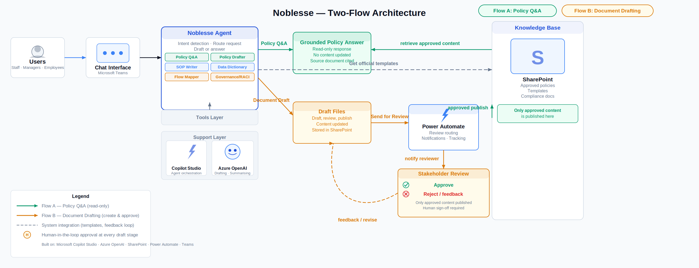

# Noblesse
### Enterprise HR Governance Agent

> *"The agent drafts. The human decides."*

---

## The Problem

HR teams at large industrial companies spend hours 
drafting policies, SOPs, and governance documents 
from scratch. No standard format. No approval process. 
No audit trail. When a policy changes — nobody knows 
what else breaks.

Noblesse fixes that.

---

## What It Does

Noblesse is an enterprise HR governance agent built 
on Microsoft Copilot Studio. HR staff have one 
conversational interface for five specialist tasks — 
all grounded in the organisation's own approved 
documents stored in SharePoint.

| Capability | What It Does |
|---|---|
| **HR Policy Q&A** | Instant answers from approved documents with source citation |
| **Policy Drafter** | Structured HR policies in QMS format |
| **SOP Writer** | Standard Operating Procedures with numbered steps and roles |
| **RACI Designer** | Governance matrices for any HR process or decision |
| **Change Analyzer** | Everything affected when a policy changes — instantly |

---

## How It Works

```
HR staff ask a question or request a document
        ↓
Noblesse responds using only approved SharePoint docs
        ↓
Draft generated → user clicks Send for Review
        ↓
Power Automate logs the draft and emails the HR reviewer
        ↓
Reviewer approves or rejects
        ↓
Document filed to SharePoint → user notified by email
```

No document reaches employees without human sign-off.

---
## Architecture



## Built With

| Layer | Technology |
|---|---|
| Agent | Microsoft Copilot Studio |
| AI Engine | Azure OpenAI — GPT-4o mini |
| Knowledge Base | SharePoint Online (RAG) |
| Approval Flow | Power Automate |
| Deployment | Microsoft Teams |

---

## Why It Is Different

Noblesse cannot invent policy details or entitlements. 
Every answer cites its source document. Every draft 
requires a human to approve it before it goes anywhere.

AI efficiency. Human accountability. Both at once.

---

## Demo Video
[](https://youtu.be/0m_Sj8W8VV0)

[Watch the Noblesse demo on YouTube](https://youtu.be/0m_Sj8W8VV0)

## Hackathon

Built for the **Agents League Hackathon 2026**  
Track: **Enterprise Agents — Microsoft 365 Copilot**  
Challenge: Build business-ready knowledge agents 
integrated with Microsoft 365 Copilot

**Submitted by:** Edward Obeng Dankwah  
**Role:** AI Developer · Cloud DevOps Engineer  
**GitHub:** [@godcandidate](https://github.com/godcandidate)

---

*Noblesse — from noblesse oblige. Governance is about 
responsibility. Every document, every decision, 
done the right way.*
```
